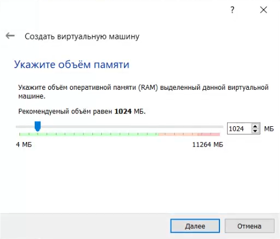
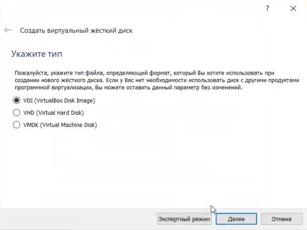
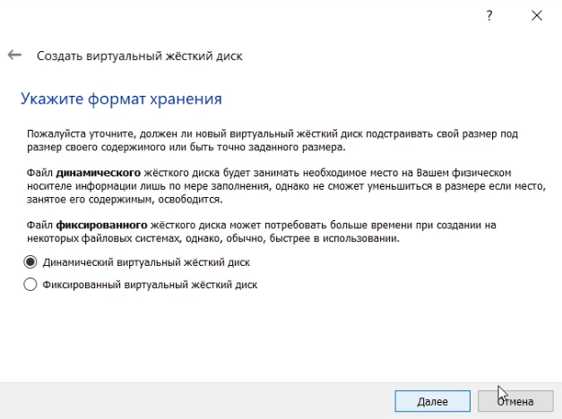
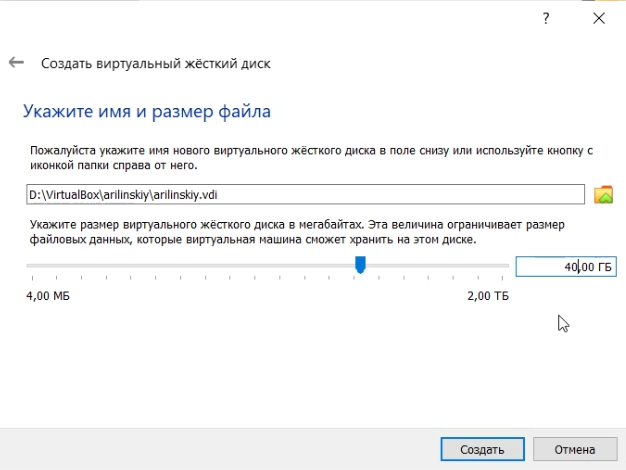
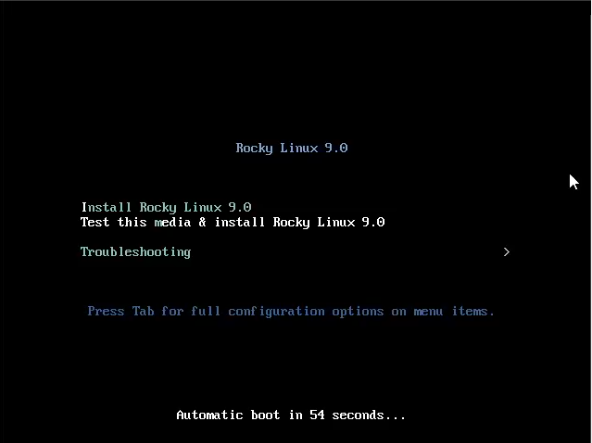
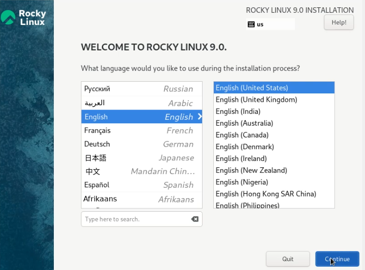
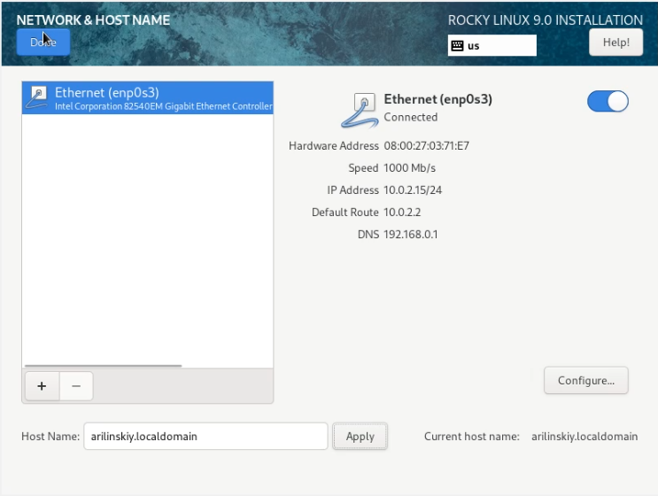
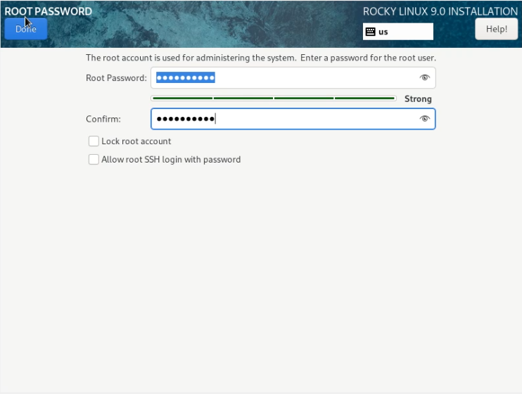
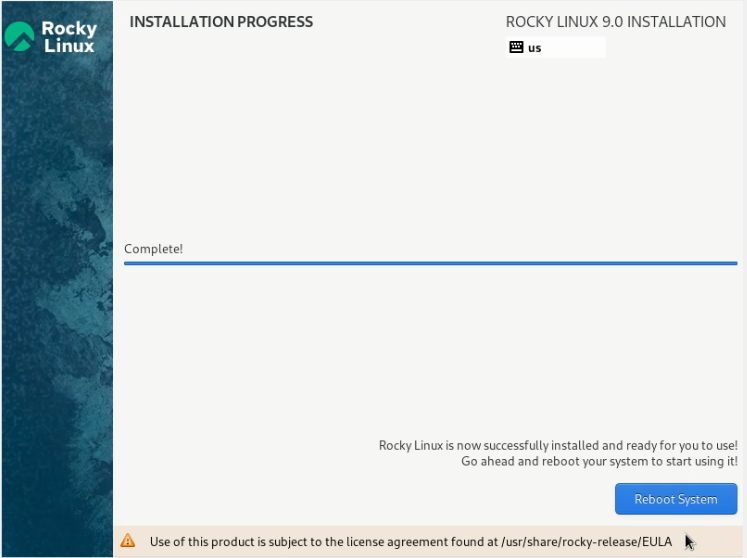

---
# Front matter
lang: ru-Ru
title: "Лабораторная работа №1"
subtitle: "Установка дистрибутива Rocky"
author: "Ильинский Арсений Александрович"

# Formatting
toc-title: "Содержание"
toc: true # Table of contents
toc_depth: 2
lof: true # List of figures
lot: true # List of tables
fontsize: 12pt
linestretch: 1.5
papersize: a4paper
documentclass: scrreprt
polyglossia-lang: russian
polyglossia-otherlangs: english
mainfont: PT Serif
romanfont: PT Serif
sansfont: PT Sans
monofont: PT Mono
mainfontoptions: Ligatures=TeX
romanfontoptions: Ligatures=TeX
sansfontoptions: Ligatures=TeX,Scale=MatchLowercase
monofontoptions: Scale=MatchLowercase
indent: true
pdf-engine: xelatex
header-includes:
  - \linepenalty=10 # the penalty added to the badness of each line within a paragraph (no associated penalty node) Increasing the value makes tex try to have fewer lines in the paragraph.
  - \interlinepenalty=0 # value of the penalty (node) added after each line of a paragraph.
  - \hyphenpenalty=50 # the penalty for line breaking at an automatically inserted hyphen
  - \exhyphenpenalty=50 # the penalty for line breaking at an explicit hyphen
  - \binoppenalty=700 # the penalty for breaking a line at a binary operator
  - \relpenalty=500 # the penalty for breaking a line at a relation
  - \clubpenalty=150 # extra penalty for breaking after first line of a paragraph
  - \widowpenalty=150 # extra penalty for breaking before last line of a paragraph
  - \displaywidowpenalty=50 # extra penalty for breaking before last line before a display math
  - \brokenpenalty=100 # extra penalty for page breaking after a hyphenated line
  - \predisplaypenalty=10000 # penalty for breaking before a display
  - \postdisplaypenalty=0 # penalty for breaking after a display
  - \floatingpenalty = 20000 # penalty for splitting an insertion (can only be split footnote in standard LaTeX)
  - \raggedbottom # or \flushbottom
  - \usepackage{float} # keep figures where there are in the text
  - \floatplacement{figure}{H} # keep figures where there are in the text
---

# Цель работы

Приобретение практических навыков установки операционной системы Rocky на виртуальную машину, а также настройка минимально необходимого окружения для дальнейшей работы.

# Задание

Установить и настроить дистрибутив Rocky на виртуальную машину, а также установить дополнения необходимые для дальнейшей работы.

# Теоретическое введение

Для выполнения данной лабораторной нет специальной теории. 

# Выполнение лабораторной работы

**Первым шагом** необходимо скачать DVD-образ операционной системы (дистрибутив Rocky) под архитектуру нашего компьютера:

{#fig:001}

**Вторым шагом** необходимо определить каталог, в который будут храниться машины:

{#fig:002}

**Третьим шагом** необходимо создать виртуальную машины в VirtualBox. Для этого выбираем ***Машина -> Создать***:

1. Сначала указываем имя и тип ОС:

   {#fig:003}

2. Затем указываем объем оперативной памяти, выделенный виртуальной машине:

   {#fig:004}

3. Далее создаем новый динамический виртуальный жесткий диск типа VDI и задаем его размер:

   {#fig:005}

   {#fig:006}

   {#fig:007}

   {#fig:008}

**Четвертым шагом** в VirtualBox заходим в ***Настройки -> Носители*** и добавляем новый привод оптических дисков, где выбираем заранее скачанный образ выбранной операционной системы.

{#fig:009}

**Пятым шагом** запускаем виртуальную машину и начинаем установку ОС.

{#fig:010}

По ходу начальной настройки ОС перед ее установкой нужно выполнить несколько шагов.

1. Выбрать язык:

   {#fig:011}

2. Настроить часовой пояс:

   {#fig:012}

3. Скорректировать раскладку клавиатуры:

   {#fig:013}

4. Выбрать пакет предустановленных программ:

   {#fig:014}

5. Отключить KDUMP:

   {#fig:015}

6. Место установки ОС оставить без изменения:

   {#fig:016}

7. Включить сетевое соединение, с именем узла arilinskiy.localadmin:

   {#fig:017}

8. Установить пароль для root:

   {#fig:018}

9. Создать пользователя с правами администратора:

   {#fig:019}

10. Правильно перезагрузить систему:

    {#fig:020}

    {#fig:021}

После выполнения данных шагов мы попадаем на рабочий стол нашей виртуальной машины. Для более удобной работы с машиной нужно подключить образ диска дополнительной гостевой ОС. Чтобы это сделать, необходимо в меню ***Устройства*** окна VirtualBox выбрать опцию подключения диска дополнительной гостевой ОС. После чего появится всплывающее окно, в котором можно запустить данный процесс:

{#fig:022}

{#fig:023}

На этом установка дистрибутива Rocky на виртуальную машину завершается.

## Домашнее задание

С помощью утилит *dmesg* и *grep* требуется найти некоторую информацию о системе:

1. Версия ядра Linux: 5.14.0-0.70.13.1
2. Частота процессора: 2195.874 MHz
3. Модель процессора: AMD Ryzen 7 2700U with Radeon Vega Mobile Gfx
4. Объем доступной памяти: 240380k
5. Тип обнаруженного гипервизора: KVM
6. Тип файловой системы корневого раздела: XFS

{#fig:024}

# Выводы

Благодаря данной лабораторной работе я приобрел практические навыки установки операционной системы Rocky на виртуальную машину, а также получил знания по настройке минимально необходимого окружения для дальнейшей работы.

# Список литературы

- <code>[Кулябов Д.С., Королькова А.В., Геворкян М.Н *Лабораторная работа №1*](https://esystem.rudn.ru/mod/folder/view.php?id=892013)</code>