

# Лабораторная работа №1
## Ilyinsky A. Arseniy 
## RUDN University, 2022 Moscow, Russia

---

# Установка и конфигурицая ОС на виртуальную машину

---

### Цель лабораторной работы:
- Приобретение практических навыков установки операционной системы на виртуальную машину.
- Настройка минимально необходимого окружения для дальнейшей работы.

---

### Задание лабораторной работы:
- Установить дистрибутив Rocky на виртуальную машину.
- Установить дополнения необходимые для дальнейшей работы.

---

# Выполнение лабораторной работы

---

### Выполнение работы:

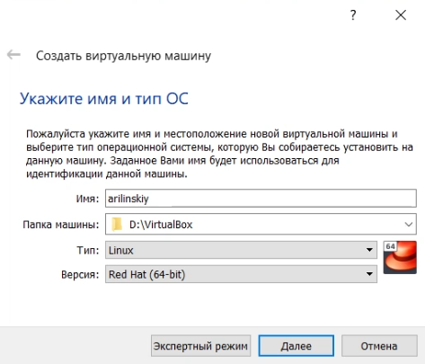
#### Рис.1 Создание виртуальной машины

---

### Выполнение работы:

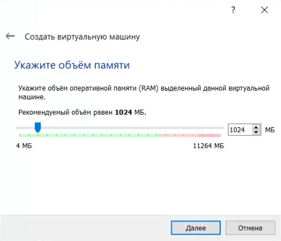
#### Рис.2 Объем оперативной памяти

---

### Выполнение работы:

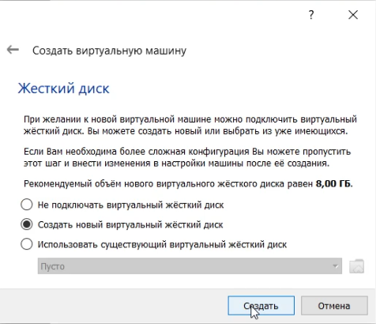
#### Рис.3 Выбор виртуального жесткого диска

---

### Выполнение работы:

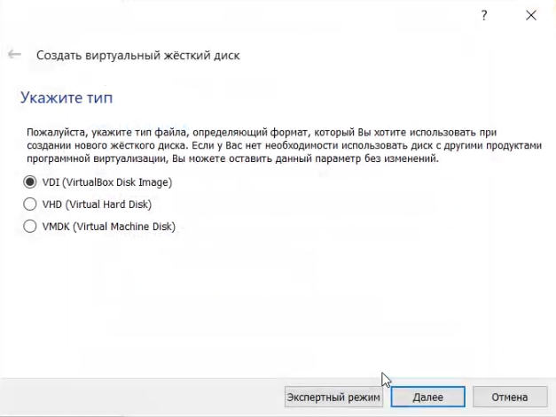
#### Рис.4 Тип файла диска

---

### Выполнение работы:

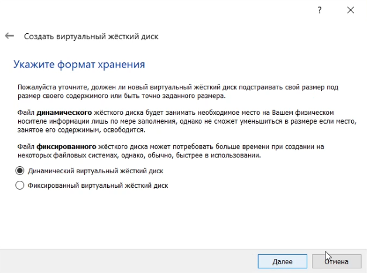
#### Рис.5 Формат хранения

---

### Выполнение работы:

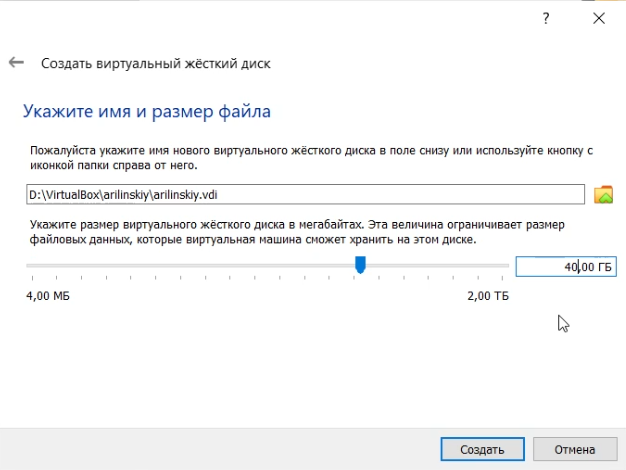
#### Рис.6 Размер виртуального жесткого диска

---

### Выполнение работы:

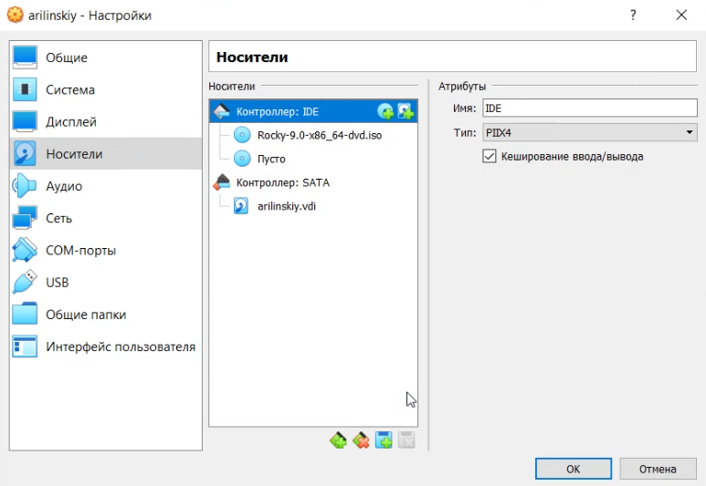
#### Рис.7 Выбор образа системы

---

### Выполнение работы:

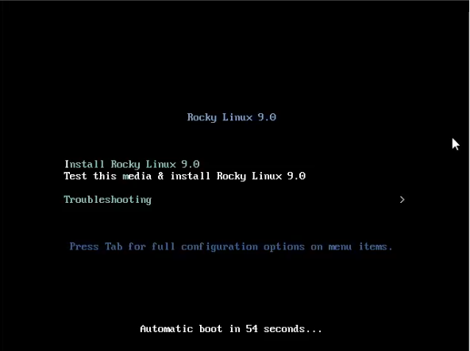
#### Рис.8 Начало установки

---

### Выполнение работы:

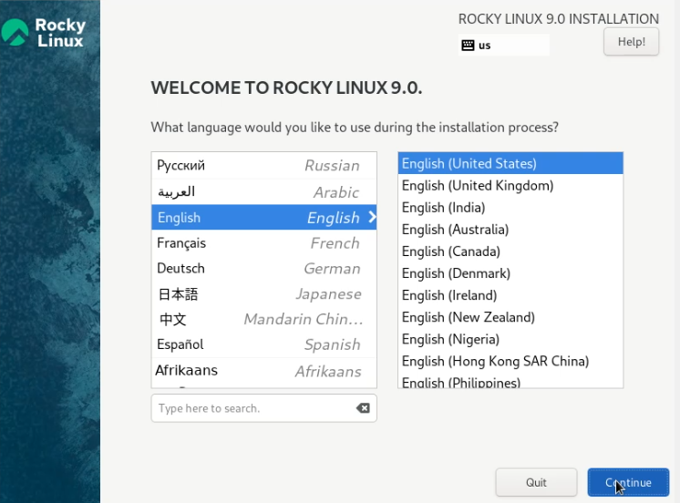
#### Рис.9 Выбор языка

---

### Выполнение работы:

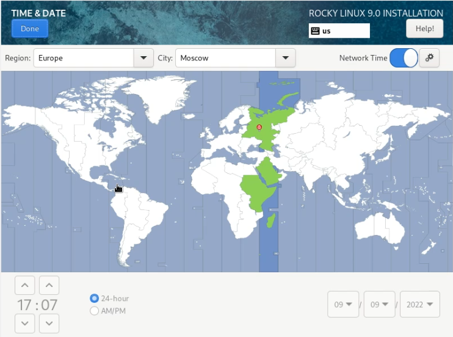
#### Рис.10 Выбор часового пояса

---

### Выполнение работы:

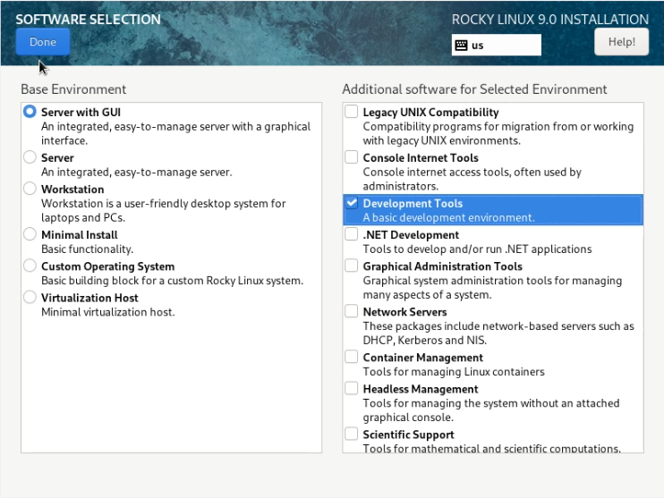
#### Рис.11 Выбор базового окружения

---

### Выполнение работы:

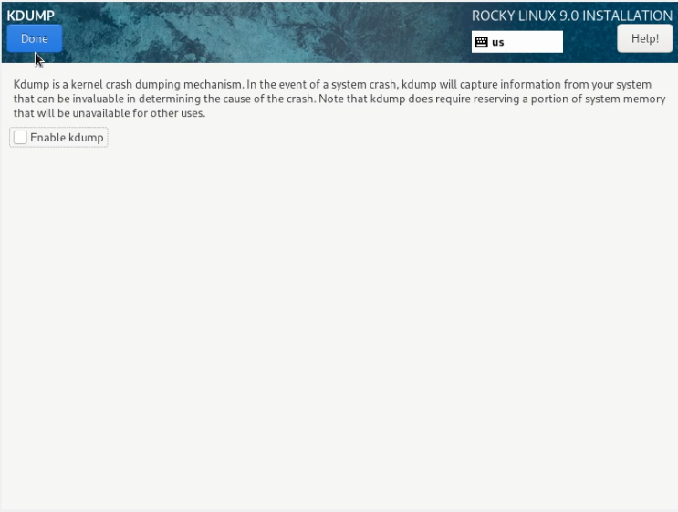
#### Рис.12 Выключение KDUMP

---

### Выполнение работы:

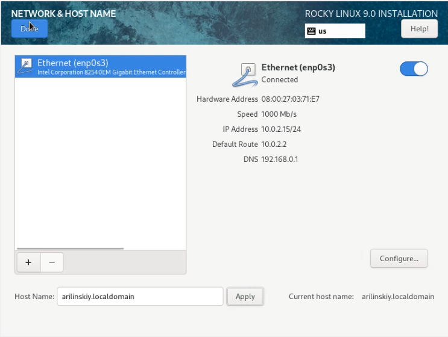
#### Рис.13 Подключение сети Ethernet

---

### Выполнение работы:

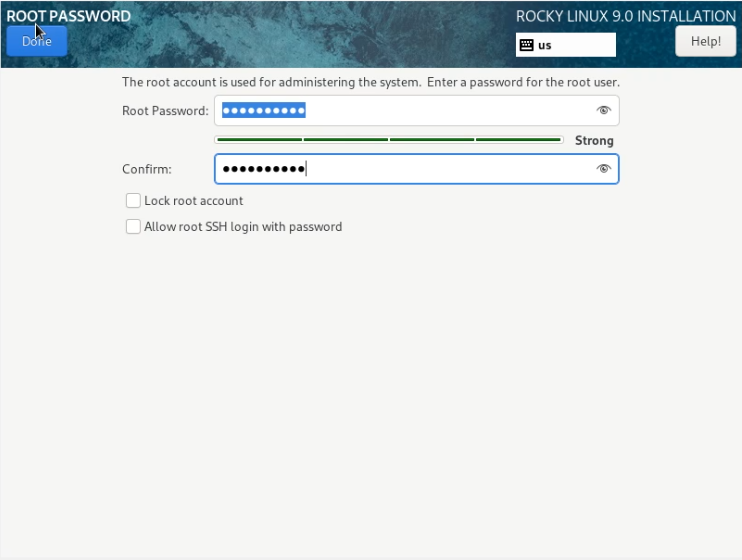
#### Рис.14 Установление root пароля

---

### Выполнение работы:

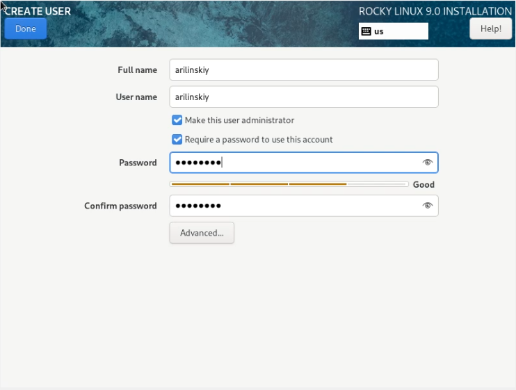
#### Рис.15 Создание пользователя с правами администартора

---

### Выполнение работы:

")
#### Рис.16 Перезагрузка после установки (1/2)

---

### Выполнение работы:

")
#### Рис.17 Перезагрузка после установки (2/2)

---

### Выполнение работы:

")
#### Рис.18 Подключение образа гостевой ОС (1/2)

---

### Выполнение работы:

")
#### Рис.19 Подключение образа гостевой ОС (2/2)

---

### Выполнение работы:

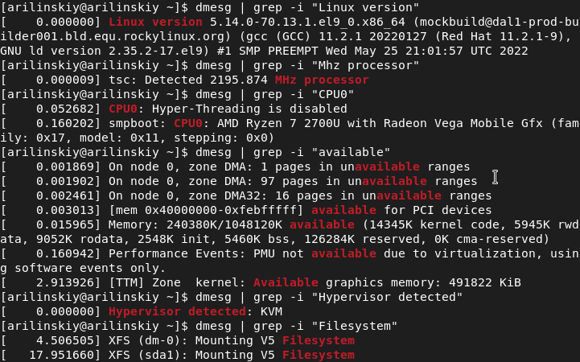
#### Рис.20 Вывод команды dmesg

---

# Вывод

---

# Спасибо за внимание