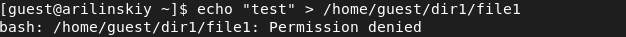
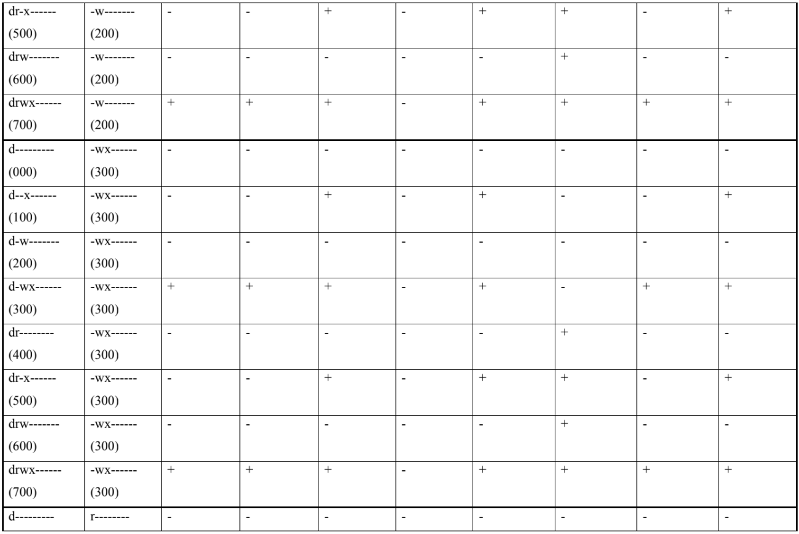

---
# Front matter
lang: ru-Ru
title: "Лабораторная работа №2"
subtitle: "Дискреционное разграничение прав в Linux"
author: "Ильинский Арсений Александрович"

# Formatting
toc-title: "Содержание"
toc: true # Table of contents
toc_depth: 2
lof: true # List of figures
lot: true # List of tables
fontsize: 12pt
linestretch: 1.5
papersize: a4paper
documentclass: scrreprt
polyglossia-lang: russian
polyglossia-otherlangs: english
mainfont: PT Serif
romanfont: PT Serif
sansfont: PT Sans
monofont: PT Mono
mainfontoptions: Ligatures=TeX
romanfontoptions: Ligatures=TeX
sansfontoptions: Ligatures=TeX,Scale=MatchLowercase
monofontoptions: Scale=MatchLowercase
indent: true
pdf-engine: xelatex
header-includes:
  - \linepenalty=10 # the penalty added to the badness of each line within a paragraph (no associated penalty node) Increasing the value makes tex try to have fewer lines in the paragraph.
  - \interlinepenalty=0 # value of the penalty (node) added after each line of a paragraph.
  - \hyphenpenalty=50 # the penalty for line breaking at an automatically inserted hyphen
  - \exhyphenpenalty=50 # the penalty for line breaking at an explicit hyphen
  - \binoppenalty=700 # the penalty for breaking a line at a binary operator
  - \relpenalty=500 # the penalty for breaking a line at a relation
  - \clubpenalty=150 # extra penalty for breaking after first line of a paragraph
  - \widowpenalty=150 # extra penalty for breaking before last line of a paragraph
  - \displaywidowpenalty=50 # extra penalty for breaking before last line before a display math
  - \brokenpenalty=100 # extra penalty for page breaking after a hyphenated line
  - \predisplaypenalty=10000 # penalty for breaking before a display
  - \postdisplaypenalty=0 # penalty for breaking after a display
  - \floatingpenalty = 20000 # penalty for splitting an insertion (can only be split footnote in standard LaTeX)
  - \raggedbottom # or \flushbottom
  - \usepackage{float} # keep figures where there are in the text
  - \floatplacement{figure}{H} # keep figures where there are in the text
---

# Цель работы

Получение практических навыков работы в консоли с атрибутами файлов. Закрепление теоретических основ дискреционного разграничения доступа в современных системах с открытым кодом на базе ОС Linux (дистрибутив - Rocky) на примерах.

# Задание

Выполнить задания из лабораторной работы и проанализировать полученные результаты.

# Теоретическое введение

Для выполнения данной лабораторной нет специальной теории. 

# Выполнение лабораторной работы

Последовательно выполнил все пункты, занося ответы на поставленные вопросы и замечания в отчет:

1. В установленной при выполнении предыдущей лабораторной работы операционной системе создал учётную запись пользователя guest (используя учётную запись администратора с правами root):

   {#fig:001}

2. Задал пароль для пользователя guest (использую учётную запись администратора с правами root):

   {#fig:002}

3. Вошел в систему от имени пользователя guest:

   {#fig:003}

   {#fig:004}

4. Определил директорию, в которой нахожусь, командой *pwd*. Она является домашней для пользователя guest, что совпадает с приглашением командной строки:

   {#fig:005}

5. Уточнил имя пользователя командой whoami:

   {#fig:006}

6. Уточнил имя пользователя (1001(guest)), его группу (1001(guest)), а также группы, куда входит пользователь (1001(guest)), командой *id*:

   {#fig:007}

   а также сравнил с выводом команды *groups*:

   {#fig:008}

   Если сравнивать вывод *id* с выводом *groups*, то очевидно, что команда *id* выводит намного больше информации.

7. Сравнил полученную информацию об имени пользователя с данными, выводимыми в приглашении командной строки:

   Полученная информация об имени пользователя совпадает с данными, выводимыми в приглашении командой строки.

8. Просмотрел файл */etc/passwd* командой *cat /etc/passwd*. Нашел в нём свою учётную запись. Определил uid (1001) пользователя. Определите gid пользователя (1001). Что совпадает с информацией полученной выше:

   {#fig:009}

   {#fig:010}

9. Определил существующие в системе директории командой *ls -l /home/*:

   {#fig:011}
   
   Как видно на [рисунке](#fig:011) , только пользователь, создавший директорию (*arilinskiy*/*guest*) имеет права на чтение (r), запись (w) и выполнение (x) файлов в директории. У остальных пользователей никаких прав нет.

10. Проверил, какие расширенные атрибуты установлены на поддиректориях, находящихся в директории /home, командой: *lsattr /home*:

    {#fig:012}

    Мне не удалось увидеть расширенные атрибуты как текущей директории, так и директории другого пользователя.

11. Создал в домашней директории поддиректорию dir1 командой *mkdir dir1*:

    {#fig:013}

    Определил командами *ls -l* и *lsattr*, какие права доступа и расширенные атрибуты были выставлены на директорию dir1:

    {#fig:014}

    У всех есть права на чтение (r) и выполнение (x), но только у создателя и группы создателя есть права на запись (w). Расширенные атрибуты просмотреть не удалось.

12. Снял с директории dir1 все атрибуты командой *chmod 000 dir1* и проверил правильность выполнения с помощью команды *ls -l*:

    {#fig:015}

13. Попытался создать в директории dir1 файл file1 командой *echo "test" > /home/guest/dir1/file1*:

    {#fig:016}

    Но получил отказ, так как в предыдущем пункте я забрал все права к директории dir1. Соответственно данный файл не был создан. 

    Попытался проверить это командой *ls -l /home/guest/dir1*, но также получил отказ из-за отсутствия прав:

    {#fig:017}

14. Заполнил таблицу «Установленные права и разрешённые действия»:

    {#fig:018}
    
    {#fig:019}
    
    {#fig:020}
    
    {#fig:021}
    
    {#fig:022}
    
    {#fig:023}

15. На основании заполненной таблицы определил минимально необходимые права для выполнения операций внутри директории dir1:

    {#fig:024}

# Выводы

Благодаря данной лабораторной работы я приобрел практические навыки работы в консоли с атрибутами файлов, а также на практике закрепил теоретические основы дискреционного разграничения доступа в современных системах с открытым кодом на базе ОС Linux (дистрибутив - Rocky).

# Список литературы

- <code>[Кулябов Д.С., Королькова А.В., Геворкян М.Н *Лабораторная работа №2*](https://esystem.rudn.ru/pluginfile.php/1651747/mod_resource/content/6/002-lab_discret_attr.pdf)</code>