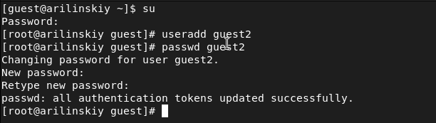
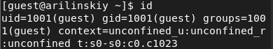
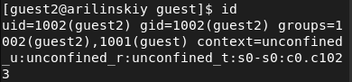
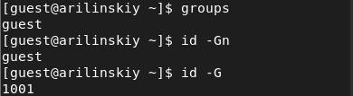
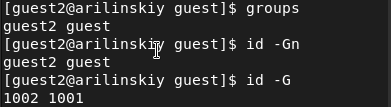
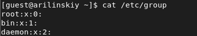
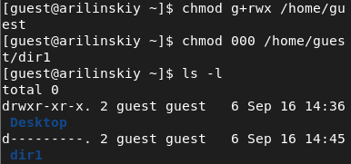
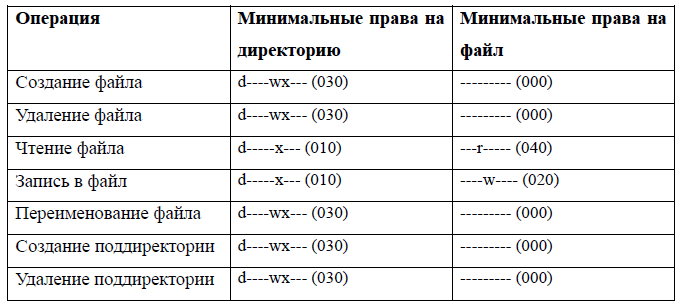

# Лабораторная работа №3
## Ilyinsky A. Arseniy 
## RUDN University, 2022 Moscow, Russia

---

# Дискреционное разграничение прав в Linux. Два пользователя

---

### Цель выполнения работы

- Получение практических навыков работы в консоли с атрибутами файлов для нескольких пользователей.

- Закрепление теоретических основ дискреционного разграничения доступа в современных системах с открытым кодом на базе ОС Linux (дистрибутив - Rocky).

---

# Выполнение работы

---

### Выполнение работы

#### Рис.1 Создание пользователя guest2

---

### Выполнение работы

#### Рис.2 Добавление пользователя guest2 в группу guest

---

### Выполнение работы

#### Рис.3 Вход в консоль от пользователя guest и guest2

---

### Выполнение работы

#### Рис.4 Нахождение пользователей guest и guest2

---

### Выполнение работы

#### Рис.5 Определение пользователей

---

### Выполнение работы

#### Рис.6 Группа, а также группы, куда входит пользователь guest

---

### Выполнение работы

#### Рис.7 Группа, а также группы, куда входит пользователь guest2

---

### Выполнение работы

#### Рис.8 Группы пользователя guest

---

### Выполнение работы

#### Рис.9 Группы пользователя guest2

---

### Выполнение работы

#### Рис.10 Вывод команды cat /etc/group

---

### Выполнение работы

#### Рис.11 Регистрация пользователя guest2 в группе guest

---

### Выполнение работы

#### Рис.12 Изменение прав на директории пользователя guest

---

### Выполнение работы

#### Рис.13 Минимально необходимые права для выполнения операций внутри директории dir1

---

# Вывод

---

# Спасибо за внимание