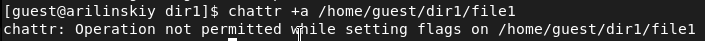
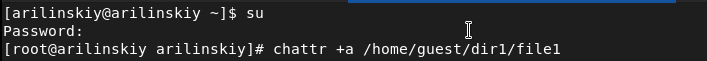
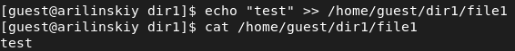
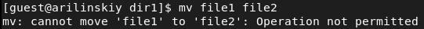
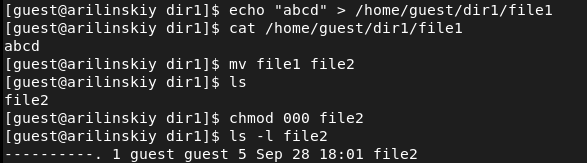
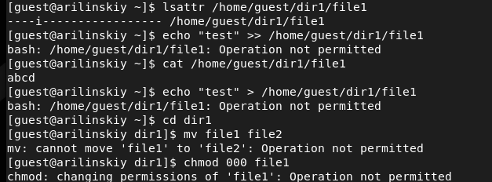

---
# Front matter
lang: ru-Ru
title: "Лабораторная работа №4"
subtitle: "Дискреционное разграничение прав в Linux. Расширенные атрибуты"
author: "Ильинский Арсений Александрович"

# Formatting
toc-title: "Содержание"
toc: true # Table of contents
toc_depth: 2
lof: true # List of figures
lot: true # List of tables
fontsize: 12pt
linestretch: 1.5
papersize: a4paper
documentclass: scrreprt
polyglossia-lang: russian
polyglossia-otherlangs: english
mainfont: PT Serif
romanfont: PT Serif
sansfont: PT Sans
monofont: PT Mono
mainfontoptions: Ligatures=TeX
romanfontoptions: Ligatures=TeX
sansfontoptions: Ligatures=TeX,Scale=MatchLowercase
monofontoptions: Scale=MatchLowercase
indent: true
pdf-engine: xelatex
header-includes:
  - \linepenalty=10 # the penalty added to the badness of each line within a paragraph (no associated penalty node) Increasing the value makes tex try to have fewer lines in the paragraph.
  - \interlinepenalty=0 # value of the penalty (node) added after each line of a paragraph.
  - \hyphenpenalty=50 # the penalty for line breaking at an automatically inserted hyphen
  - \exhyphenpenalty=50 # the penalty for line breaking at an explicit hyphen
  - \binoppenalty=700 # the penalty for breaking a line at a binary operator
  - \relpenalty=500 # the penalty for breaking a line at a relation
  - \clubpenalty=150 # extra penalty for breaking after first line of a paragraph
  - \widowpenalty=150 # extra penalty for breaking before last line of a paragraph
  - \displaywidowpenalty=50 # extra penalty for breaking before last line before a display math
  - \brokenpenalty=100 # extra penalty for page breaking after a hyphenated line
  - \predisplaypenalty=10000 # penalty for breaking before a display
  - \postdisplaypenalty=0 # penalty for breaking after a display
  - \floatingpenalty = 20000 # penalty for splitting an insertion (can only be split footnote in standard LaTeX)
  - \raggedbottom # or \flushbottom
  - \usepackage{float} # keep figures where there are in the text
  - \floatplacement{figure}{H} # keep figures where there are in the text
---

# Цель работы

Получение практических навыков работы в консоли с расширенными атрибутами файлов.

# Задание

Выполнить задания из лабораторной работы и проанализировать полученные результаты.

# Теоретическое введение

Для выполнения данной лабораторной нет специальной теории. 

# Выполнение лабораторной работы

Последовательно выполнил все пункты, занося ответы на поставленные вопросы
и замечания в отчет:

1. От имени пользователя guest определил расширенные атрибуты файла */home/guest/dir1/file1* командой *lsattr /home/guest/dir1/file1*:
   
   {#fig:001}

2. Установил командой *chmod 600 file1* на файл *file1* права, разрешающие чтение и запись для владельца файла:

   {#fig:002}

3. Попробовал установить на файл */home/guest/dir1/file1* расширенный атрибут **a** от имени пользователя guest командой *chattr +a /home/guest/dir1/file1*:

   В ответ получил отказ от выполнения операции:

   {#fig:003}

4. Повысил свои права с помощью команды *su*. Попробовал установить расширенный атрибут **a** на файл */home/guest/dir1/file1* от имени суперпользователя командой *chattr +a /home/guest/dir1/file1*:

   {#fig:004}

5. От пользователя guest проверил правильность установления атрибута командой *lsattr /home/guest/dir1/file1*:

   {#fig:005}

6. Выполнил дозапись в файл file1 слова «test» командой *echo "test" /home/guest/dir1/file1*:

   После этого выполнил чтение файла *file1* командой *cat /home/guest/dir1/file1*:

   {#fig:006}

   Дозапись прошла успешно.

7. Попробовал стереть имеющуюся в файле информацию командой *echo "abcd" > /home/guest/dirl/file1*:

   {#fig:007}

   Затем попробовал переименовать файл командой *mv file1 file2*:

   {#fig:008}

8. Попробовал с помощью команды *chmod 000 file1* установить на файл *file1* права, запрещающие чтение и запись для владельца файла:

   {#fig:009}

   Данная операция над файлом не позволена.

9. Снял расширенный атрибут **a** с файла */home/guest/dirl/file1* от имени суперпользователя командой *chattr -a /home/guest/dir1/file1*:

   {#fig:010}

   Повторил операции, которые ранее не удавалось выполнить:

   {#fig:011}

   После выполнения пришел к выводу, что атрибут **а** позволяет добавлять информацию в файл, но удалять ее, переименовывать файл или менять права доступа к нему нельзя. Атрибут может быть установлен только суперпользователем.

10. Повторил те же действия по шагам для файла *file1*, откатив изменения:

    {#fig:012}

    и заменив атрибут **a** атрибутом **i**:
    
    {#fig:013}
    
    {#fig:010}
    
    После выполнения пришел к выводу, что атрибут **i** указывает на то, что нельзя изменять название файла, его содержимое и права доступа. Атрибут может быть установлен только суперпользователем.

# Выводы

В результате выполнения работы я повысил свои навыки использования интерфейса командой строки (CLI), познакомился на примерах с тем, как используются основные и расширенные атрибуты при разграничении доступа. Имел возможность связать теорию дискреционного разделения доступа (дискреционная политика безопасности) с её реализацией на практике в ОС Linux (дистрибутив - Rocky). Опробовал действие на практике расширенных атрибутов **а** и **i**.

# Список литературы

- <code>[Кулябов Д.С., Королькова А.В., Геворкян М.Н *Лабораторная работа №4*](https://esystem.rudn.ru/pluginfile.php/1651751/mod_resource/content/3/004-lab_discret_extattr.pdf)</code>