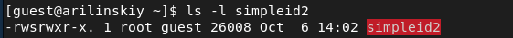

---
# Front matter
lang: ru-Ru
title: "Лабораторная работа №5"
subtitle: "Дискреционное разграничение прав в Linux. Исследование влияния дополнительных атрибутов"
author: "Ильинский Арсений Александрович"

# Formatting
toc-title: "Содержание"
toc: true # Table of contents
toc_depth: 2
lof: true # List of figures
lot: true # List of tables
fontsize: 12pt
linestretch: 1.5
papersize: a4paper
documentclass: scrreprt
polyglossia-lang: russian
polyglossia-otherlangs: english
mainfont: PT Serif
romanfont: PT Serif
sansfont: PT Sans
monofont: PT Mono
mainfontoptions: Ligatures=TeX
romanfontoptions: Ligatures=TeX
sansfontoptions: Ligatures=TeX,Scale=MatchLowercase
monofontoptions: Scale=MatchLowercase
indent: true
pdf-engine: xelatex
header-includes:
  - \linepenalty=10 # the penalty added to the badness of each line within a paragraph (no associated penalty node) Increasing the value makes tex try to have fewer lines in the paragraph.
  - \interlinepenalty=0 # value of the penalty (node) added after each line of a paragraph.
  - \hyphenpenalty=50 # the penalty for line breaking at an automatically inserted hyphen
  - \exhyphenpenalty=50 # the penalty for line breaking at an explicit hyphen
  - \binoppenalty=700 # the penalty for breaking a line at a binary operator
  - \relpenalty=500 # the penalty for breaking a line at a relation
  - \clubpenalty=150 # extra penalty for breaking after first line of a paragraph
  - \widowpenalty=150 # extra penalty for breaking before last line of a paragraph
  - \displaywidowpenalty=50 # extra penalty for breaking before last line before a display math
  - \brokenpenalty=100 # extra penalty for page breaking after a hyphenated line
  - \predisplaypenalty=10000 # penalty for breaking before a display
  - \postdisplaypenalty=0 # penalty for breaking after a display
  - \floatingpenalty = 20000 # penalty for splitting an insertion (can only be split footnote in standard LaTeX)
  - \raggedbottom # or \flushbottom
  - \usepackage{float} # keep figures where there are in the text
  - \floatplacement{figure}{H} # keep figures where there are in the text
---

# Цель работы

Изучение механизмов изменения идентификаторов, применения SetUID- и Sticky-битов. Получение практических навыков работы в консоли с дополнительными атрибутами. Рассмотрение работы механизма смены идентификатора процессов пользователей, а также влияние бита Sticky на запись и удаление файлов.

# Задание

Выполнить задания из лабораторной работы и проанализировать полученные результаты.

# Теоретическое введение

Для выполнения данной лабораторной нет специальной теории. 

# Выполнение лабораторной работы

## Подготовка к работе

Проверю, установлен ли у меня компилятор gcc командой gcc –v:

{#fig:001}

У меня он уже установлен.

Установил setenforce в 0 и проверил, что данная команда выполнилась:

{#fig:002}

## Создание программы

Вошел в систему от имени пользователя guest и создал программу simpleid.c

{#fig:003}

```c
#include <sys/types.h>
#include <unistd.h>
#include <stdio.h>
int
main ()
{
	uid_t uid = geteuid ();
	gid_t gid = getegid ();
	printf ("uid=%d, gid=%d\n", uid, gid);
	return 0;
}

```

Скомпилирую программу командой *gcc* *simpleid.**c -**o* *simpleid* и запустил ее

{#fig:004}

Выполню системную программу id командой *id*. Как видно результат совпадает:

{#fig:005}

Усложню программу, добавив вывод действительных идентификаторов.

```c
#include <sys/types.h>
#include <unistd.h>
#include <stdio.h>
int
main ()
{
	uid_t real_uid = getuid ();
	uid_t e_uid = geteuid ();
	gid_t real_gid = getgid ();
	gid_t e_gid = getegid () ;
	printf ("e_uid=%d, e_gid=%d\n", e_uid, e_gid);
	printf ("real_uid=%d, real_gid=%d\n", real_uid,real_gid);
	return 0;
}

```

Скомпилирую в новый файл simpleid2

{#fig:006}

## Работа с е SetUID-битом и SetGID-битом

От имени суперпользователя выполню команды:

1. *chown root:guest /home/guest/simpleid2*
2. *chmod u+s /home/guest/simpleid2*

{#fig:007}

*Пояснение*:

- Команда *chown root:guest /home/guest/simpleid2* меняет владельца файла. 

- Команда *chmod* *u+**s /**home/**guest/**simpleid2* меняет права доступа к файлу.

Проверю правильность установки новых атрибутов и смены владельца файла simpleid2 командой: *ls -l simpleid2*

{#fig:008}

Запущу simpleid2 и id, командами соответственно:  *./simpleid2* и *id*

{#fig:009}

Создам программу readfile.c:

```c
#include <fcntl.h>
#include <stdio.h>
#include <sys/stat.h>
#include <sys/types.h>
#include <unistd.h>
int
main (int argc, char* argv[])
{
	unsigned char buffer[16];
	size_t bytes_read;
	int i;
	int fd = open (argv[1], O_RDONLY);
	do
	{
		bytes_read = read (fd, buffer, sizeof (buffer));
		for (i =0; i < bytes_read; ++i) printf("%c", buffer[i]);
	}
	while (bytes_read == sizeof (buffer));
	close (fd);
	return 0;
}
```

{#fig:0010}

Скомпилирую её командой: *gcc readfile.c -o readfile*, а затем сменю владельца у файла readfile.c и изменю права так, чтобы только суперпользователь (root) мог прочитать его, a guest не мог:

{#fig:0011}

Как видим, пользователь guest не может прочитать файл readfile.c.

Сменю у программы readfile владельца и установлю SetUID-бит:

{#fig:0012}

Проверю, может ли программа readfile прочитать файл readfile.c:

{#fig:0013}

{#fig:0014}

Поскольку у программы установлен SetUID-бит, то ей временно предоставляются права владельца файла (суперпользователя). Поэтому программа может прочитать файл с правами доступа только для владельца суперпользователя

## Исследование Sticky-бита

**Проделаю ряд действий**:

1. Выясню, установлен ли атрибут Sticky на директории /tmp, для чего выполню команду:

   *ls -l / | grep tmp*

2. От имени пользователя guest создам файл file01.txt в директории /tmp со словом test:

   *echo "test" > /tmp/file01.txt*

3. Просмотрю атрибуты у только что созданного файла и разрешу чтение и запись для категории пользователей «все остальные»:

   *ls -l /tmp/file01.txt*

   *chmod o+rw /tmp/file01.txt*

   *ls -l /tmp/file01.txt*

4. От пользователя guest2 (не являющегося владельцем) попробую прочитать файл /tmp/file01.txt:

   *cat /**tmp/**file01.**txt*

5. От пользователя guest2 попробую дозаписать в файл /tmp/file01.txt слово test2 командой: 

   *echo "test2" >> /tmp/file01.txt*. 

   Мне удалось выполнить операцию.

6. Проверю содержимое файла командой: 

   *cat /tmp/file01.txt*

7. От пользователя guest2 попробую записать в файл /tmp/file01.txt слово test3, стерев при этом всю имеющуюся в файле информацию командой: 

   echo *"test3" > /tmp/file01.txt*

   Мне удалось выполнить операцию.

8. Проверю содержимое файла командой: 

   *cat /tmp/file01.txt*

9. От пользователя guest2 попробую удалить файл /tmp/file01.txt командой:

    *rm /tmp/file01.txt*

   Мне не удалось удалить файл

{#fig:0015}

**Повышу свои права до суперпользователя и сниму Sticky-бит, после чего повторю проделанные раннее шаги**:

1. Повышу свои права до суперпользователя следующей командой *su* и выполню после этого команду, снимающую атрибут t (Sticky-бит) с директории /tmp: 

   *chmod -t /tmp*

2. От пользователя guest2 проверил, что атрибута t у директории /tmp нет: 

   *ls -l / | grep tmp*

3. Повторю предыдущие шаги.

{#fig:0016}

{#fig:0017}

Мне удалось удалить файл от имени пользователя, не являющегося его владельцем. Это связано с тем, что Sticky-bit позволяет защищать файлы от случайного удаления, когда несколько пользователей имеют права на запись в один и тот же каталог. Если у файла атрибут t стоит, значит пользователь может удалить файл, только если он является пользователем-владельцем файла или каталога, в котором содержится файл. Если же этот атрибут не установлен, то удалить файл могут все пользователи, которым позволено удалять файлы из каталога.

**Повышу свои права до суперпользователя и верну Sticky-бит**:

1.  Верну атрибут t на директорию /tmp:

   *su*

   *chmod +t /tmp*

   *exit*

{#fig:0018}

# Выводы

Благодаря данной лабораторной работе я изучил механизмы изменения идентификаторов, применения SetUID-, SetGID- и Sticky-битов. Рассмотрел работу механизма смены идентификатора процессов пользователей, а также влияние бита Sticky на запись и удаление файлов.


# Список литературы

- <code>[Кулябов Д.С., Королькова А.В., Геворкян М.Н *Лабораторная работа №5*](https://esystem.rudn.ru/pluginfile.php/1651753/mod_resource/content/2/005-lab_discret_sticky.pdf)</code>