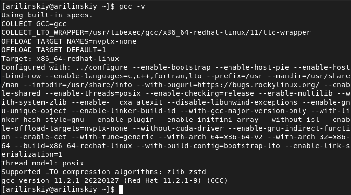
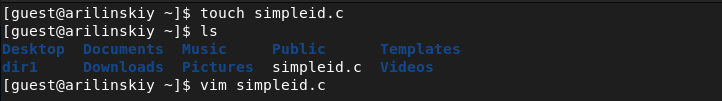
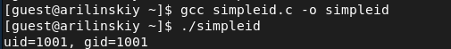
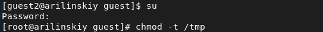
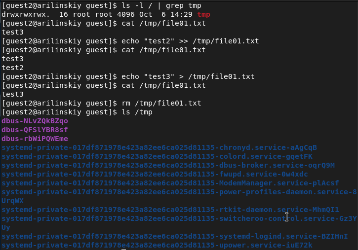

<style>
section::after {
  content: attr(data-marpit-pagination) ' / ' attr(data-marpit-pagination-total);
}
img[alt="center"] {
     display: block;
     margin: 0 auto;
}
th {
    font-size: 25px;
}
td {
    font-size: 25px;
}
img[alt="center"] {
    display: block;
    margin: 0 auto;
}
h1 {
    font-size: 60px;
    text-align: center;
}
h2 {
    font-size: 30px;
    text-align: left;
    position: relative;
    left: -2em;
    line-height: 0px;
    top: 8em;
}
h3 {
    font-size: 40px;
    text-align: left;
    position: relative;
    left: -0em;
    bottom: 0.2em;
}
h4 {
    text-align: center;
    position: relative;
    font-size: 25px;
    bottom: 1.2em;
}
h5 {
    font-size: 20px;
    text-align: center;
    position: relative;
    bottom: 3em;
}
</style>

# Лабораторная работа №5
## Ilyinsky A. Arseniy 
## RUDN University, 2022 Moscow, Russia

---

# Дискреционное разграничение прав в Linux. Исследование влияния дополнительных атрибутов

---

### Цель выполнения работы

- Изучение механизмов изменения идентификаторов, применения SetUID- и Sticky-битов

- Получение практических навыков работы в консоли с дополнительными атрибутами

- Рассмотрение работы механизма смены идентификатора процессов пользователей, а также влияние бита Sticky на запись и удаление файлов

---

# Выполнение работы

---

### Выполнение работы


#### Рис.1 Компилятор gcc

---

### Выполнение работы


#### Рис.2 Отключение SELinux

---

### Выполнение работы


#### Рис.3 Создание программы simpleid.c

---

### Выполнение работы

``` c
#include <sys/types.h>
#include <unistd.h>
#include <stdio.h>
int
main ()
{
	uid_t uid = geteuid ();
	gid_t gid = getegid ();
	printf ("uid=%d, gid=%d\n", uid, gid);
	return 0;
}
```
#### Код программы simpleid.c

---

### Выполнение работы


#### Рис.4 Компиляция и выполнение simpleid.c

---

### Выполнение работы


#### Рис.5 Результат команды id

---

### Выполнение работы

``` c
#include <sys/types.h>
#include <unistd.h>
#include <stdio.h>
int
main ()
{
	uid_t real_uid = getuid ();
	uid_t e_uid = geteuid ();
	gid_t real_gid = getgid ();
	gid_t e_gid = getegid () ;
	printf ("e_uid=%d, e_gid=%d\n", e_uid, e_gid);
	printf ("real_uid=%d, real_gid=%d\n", real_uid,real_gid);
	return 0;
}
```
#### Код программы simpleid2.c

---

### Выполнение работы


#### Рис.6 Компиляция и выполнение simpleid2

---

### Выполнение работы


#### Рис.7 Изменение владельца и прав на файл simpleid2

---

### Выполнение работы


#### Рис.8 Выполнение simpleid2 и id

---

### Выполнение работы

``` c
#include <fcntl.h>
#include <stdio.h>
#include <sys/stat.h>
#include <sys/types.h>
#include <unistd.h>
int
main (int argc, char* argv[])
{
	unsigned char buffer[16];
	size_t bytes_read;
	int i;
	int fd = open (argv[1], O_RDONLY);
	do
	{
		bytes_read = read (fd, buffer, sizeof (buffer));
		for (i =0; i < bytes_read; ++i) printf("%c", buffer[i]);
	}
	while (bytes_read == sizeof (buffer));
	close (fd);
	return 0;
}
```
#### Код программы readfile.c

---

### Выполнение работы


#### Рис.9 Изменение владельца и прав на файл readfile.c. Получение отказа в чтении подьзователю guest

---

### Выполнение работы


#### Рис.11 Установка UID бита для readfile.c

---

### Выполнение работы


#### Рис.12 Выполнение программы для файла readfile.c

---

### Выполнение работы


#### Рис.13 Выполнение программы для файла /etc/shadow

---

### Выполнение работы


#### Рис.14 Работа со Sticky битом

---

### Выполнение работы


#### Рис.15 Работа с файлом без Sticly бита (1/2)

---

### Выполнение работы


#### Рис.15 Работа с файлом без Sticly бита (2/2)

---

### Выполнение работы


#### Рис.16 Установление атрибута t

---

# Вывод

---

# Спасибо за внимание