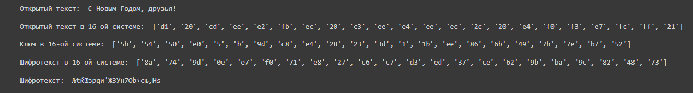
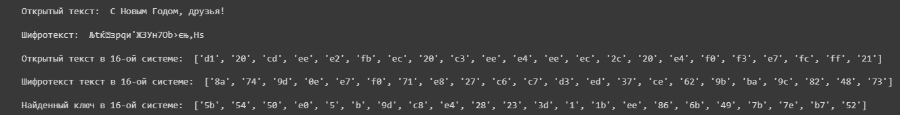
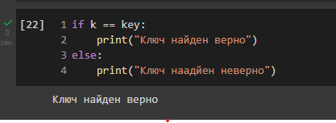

<style>
section::after {
  content: attr(data-marpit-pagination) ' / ' attr(data-marpit-pagination-total);
}
img[alt="center"] {
     display: block;
     margin: 0 auto;
}
th {
    font-size: 25px;
}
td {
    font-size: 25px;
}
img[alt="center"] {
    display: block;
    margin: 0 auto;
}
h1 {
    font-size: 60px;
    text-align: center;
}
h2 {
    font-size: 30px;
    text-align: left;
    position: relative;
    left: -2em;
    line-height: 0px;
    top: 8em;
}
h3 {
    font-size: 40px;
    text-align: left;
    position: relative;
    left: -0em;
    bottom: 0.2em;
}
h4 {
    text-align: center;
    position: relative;
    font-size: 25px;
    bottom: 1.2em;
}
h5 {
    font-size: 20px;
    text-align: center;
    position: relative;
    bottom: 3em;
}
</style>

# Лабораторная работа №7
## Ilyinsky A. Arseniy 
## RUDN University, 2022 Moscow, Russia

--- 

# Элементы криптографии. Однократное гаммирование

---

### Цель выполнения работы

- Освоить на практике применение режима однократного гаммирования

---

### Задание

Требуется разработать приложение, позволяющее шифровать и дешифровать данные в режиме однократного гаммирования.

Приложение должно: 

1. Определить вид шифротекста при известном ключе и известном открытом тексте. 
2. Определить ключ, с помощью которого шифротекст может быть преобразован в некоторый фрагмент текста, представляющий собой один из возможных вариантов прочтения открытого текста.

---

# Выполнение работы

---

### Выполнение работы

``` python
import numpy as np
import operator as op
import sys

s = "С Новым Годом, друзья!"

def encryption(text):
    print("Открытый текст: ", text)

    new_text = []
    for i in text:
        new_text.append(i.encode("cp1251").hex())
    print("\nОткрытый текст в 16-ой системе: ", new_text)

    r = np.random.randint(0, 255, len(text))
    key = [hex(i)[2:] for i in r]

    new_key = []
    for i in key:
            new_key.append(i.encode("cp1251").hex().upper())
    print("\nКлюч в 16-ой системе: ", key)

    xor_text = []
    for i in range(len(new_text)):
        xor_text.append("{:02x}".format(int(key[i], 16) ^ int(new_text[i], 16)))
    print("\nШифротекст в 16-ой системе: ", xor_text)

    en_text = bytearray.fromhex("".join(xor_text)).decode("cp1251")
    print("\nШифротекст: ", en_text)
    
    return key, xor_text, en_text
```

---

### Выполнение работы

``` python
def find_key(text, en_text):
    print("Открытый текст: ", text)
    print("\nШифротекст: ", en_text)
    
    new_text = []
    for i in text:
        new_text.append(i.encode("cp1251").hex())
    print("\nОткрытый текст в 16-ой системе: ", new_text)
    
    tmp_text = []
    for i in en_text:
        tmp_text.append(i.encode("cp1251").hex())
    print("\nШифротекст текст в 16-ой системе: ", tmp_text)
    
    xor_text = [hex(int(k,16)^int(t,16))[2:] for (k,t) in zip(new_text, tmp_text)]
    print("\nНайденный ключ в 16-ой системе: ", xor_text)
    return xor_text
```

---

### Выполнение работы

``` python
k, t, et = encryption(s)
key = find_key(s, et)

if k == key:
    print("Ключ найден верно")
else:
    print("Ключ найден неверно")
```

---

### Выполнение работы


#### Рис.1 Вывод функции encryption

---

### Выполнение работы


#### Рис.2 Вывод функции decryption

---

### Выполнение работы


#### Рис.3 Проверка полученного ключа

---

# Вывод

---

# Спасибо за внимание
