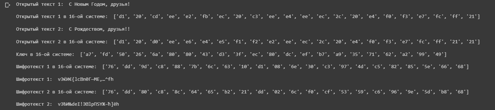
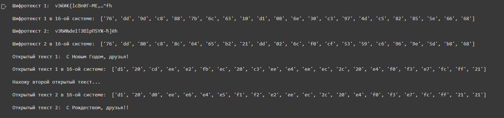

---
# Front matter
lang: ru-Ru
title: "Лабораторная работа №8"
subtitle: "Элементы криптографии. Шифрование (кодирование) различных исходных текстов одним ключом"
author: "Ильинский Арсений Александрович"

# Formatting
toc-title: "Содержание"
toc: true # Table of contents
toc_depth: 2
lof: true # List of figures
lot: true # List of tables
fontsize: 12pt
linestretch: 1.5
papersize: a4paper
documentclass: scrreprt
polyglossia-lang: russian
polyglossia-otherlangs: english
mainfont: PT Serif
romanfont: PT Serif
sansfont: PT Sans
monofont: PT Mono
mainfontoptions: Ligatures=TeX
romanfontoptions: Ligatures=TeX
sansfontoptions: Ligatures=TeX,Scale=MatchLowercase
monofontoptions: Scale=MatchLowercase
indent: true
pdf-engine: xelatex
header-includes:
  - \linepenalty=10 # the penalty added to the badness of each line within a paragraph (no associated penalty node) Increasing the value makes tex try to have fewer lines in the paragraph.
  - \interlinepenalty=0 # value of the penalty (node) added after each line of a paragraph.
  - \hyphenpenalty=50 # the penalty for line breaking at an automatically inserted hyphen
  - \exhyphenpenalty=50 # the penalty for line breaking at an explicit hyphen
  - \binoppenalty=700 # the penalty for breaking a line at a binary operator
  - \relpenalty=500 # the penalty for breaking a line at a relation
  - \clubpenalty=150 # extra penalty for breaking after first line of a paragraph
  - \widowpenalty=150 # extra penalty for breaking before last line of a paragraph
  - \displaywidowpenalty=50 # extra penalty for breaking before last line before a display math
  - \brokenpenalty=100 # extra penalty for page breaking after a hyphenated line
  - \predisplaypenalty=10000 # penalty for breaking before a display
  - \postdisplaypenalty=0 # penalty for breaking after a display
  - \floatingpenalty = 20000 # penalty for splitting an insertion (can only be split footnote in standard LaTeX)
  - \raggedbottom # or \flushbottom
  - \usepackage{float} # keep figures where there are in the text
  - \floatplacement{figure}{H} # keep figures where there are in the text
---

# Цель работы

1. Освоить на практике применение режима однократного гаммирования на примере кодирования различных исходных текстов одним ключом

# Задание

Два текста кодируются одним ключом (однократное гаммирование). Требуется не зная ключа и не стремясь его определить, прочитать оба текста. Необходимо разработать приложение, позволяющее шифровать и дешифровать тексты $P_1$ и $P_2$ в режиме однократного гаммирования. Приложение должно определить вид шифротекстов $C_1$ и $C_2$ обоих текстов $P_1$ и $P_2$ при известном ключе ; Необходимо определить и выразить аналитически способ, при котором злоумышленник может прочитать оба текста, не зная ключа и не стремясь его определить.

# Теоретическое введение

Для выполнения данной лабораторной нет специальной теории.

# Выполнение лабораторной работы

```python
import numpy as np
import operator as op
import sys

s1 = "С Новым Годом, друзья!"

s2 = "С Рождеством, друзья!!"

def encryption(text1, text2):
    print("Открытый текст 1: ", text1)
    new_text1 = []
    for i in text1:
        new_text1.append(i.encode("cp1251").hex())
    print("\nОткрытый текст 1 в 16-ой системе: ", new_text1)
    
    print("\nОткрытый текст 2: ", text2)
    new_text2 = []
    for i in text2:
        new_text2.append(i.encode("cp1251").hex())
    print("\nОткрытый текст 2 в 16-ой системе: ", new_text2)
    
    r = np.random.randint(0, 255, len(text1))
    key = [hex(i)[2:] for i in r]
    new_key = []
    for i in key:
            new_key.append(i.encode("cp1251").hex().upper())
    print("\nКлюч в 16-ой системе: ", key)
    
    xor_text1 = []
    for i in range(len(new_text1)):
        xor_text1.append("{:02x}".format(int(key[i], 16) ^ int(new_text1[i], 16)))
    print("\nШифротекст 1 в 16-ой системе: ", xor_text1)
    en_text1 = bytearray.fromhex("".join(xor_text1)).decode("cp1251")
    print("\nШифротекст 1: ", en_text1)
    
    xor_text2 = []
    for i in range(len(new_text2)):
        xor_text2.append("{:02x}".format(int(key[i], 16) ^ int(new_text2[i], 16)))
    print("\nШифротекст 2 в 16-ой системе: ", xor_text2)
    en_text2 = bytearray.fromhex("".join(xor_text2)).decode("cp1251")
    print("\nШифротекст 2: ", en_text2)
    
    return key, xor_text1, en_text1, xor_text2, en_text2

def decryption(c1, c2, p1):
    print("Шифротекст 1: ", c1)
    new_c1 = []
    for i in c1:
        new_c1.append(i.encode("cp1251").hex())
    print("\nШифротекст 1 в 16-ой системе: ", new_c1)
    
    print("\nШифротекст 2: ", c2)
    new_c2 = []
    for i in c2:
        new_c2.append(i.encode("cp1251").hex())
    print("\nШифротекст 2 в 16-ой системе: ", new_c2)
    
    print("\nОткрытый текст 1: ", p1)
    new_p1 = []
    for i in p1:
        new_p1.append(i.encode("cp1251").hex())
    print("\nОткрытый текст 1 в 16-ой системе: ", new_p1)
    
    print("\nНахожу второй открытый текст...")
    
    xor_tmp = []
    sp2 = []
    for i in range(len(p1)):
        xor_tmp.append("{:02x}".format(int(new_c1[i], 16) ^ int(new_c2[i], 16)))
        sp2.append("{:02x}".format(int(xor_tmp[i], 16) ^ int(new_p1[i], 16)))
    print("\nОткрытый текст 2 в 16-ой системе: ", sp2)
    
    p2 = bytearray.fromhex("".join(sp2)).decode("cp1251")
    print("\nОткрытый текст 2: ", p2)
    return p2, sp2

k, t1, et1, t2, et2 = encryption(s1, s2)
s3 = decryption(et1, et2, s1)
```

Результаты работы программы:

{#fig:001}

{#fig:002}

# Ответы на контрольные вопросы

1. Как, зная один из текстов ($P_1$ или $P_2$), определить другой, не зная при этом ключа?
   Для этого надо воспользоваться формулой: $C_1 .xor C_2 .xor P_1 = P_1 .xor P_2 .xor P_1 = P_2$, где $*С_1*$ и $*С_2*$ – шифротексты. Как видно, ключ в данной формуле не используется.
2. Что будет при повторном использовании ключа при шифровании текста?
   В таком случае мы получим исходное сообщение.
3. Как реализуется режим шифрования однократного гаммирования одним ключом двух открытых текстов?Он реализуется по следующей формуле:$C_1 = P_1 .xor K$, $C_2 = P_2 .xor K$, где $*С_1*$ и $*С_2*$ – шифротексты, $K$ - ключ шифрования.
4. Перечислите недостатки шифрования одним ключом двух открытых текстов.
   Во-первых, имея на руках одно из сообщений в открытом виде и оба шифротекста, злоумышленник способен расшифровать каждое сообщение, не зная ключа. 
   Во-вторых, зная шаблон сообщений, злоумышленник получает возможность определить те символы сообщения $*P_2*$, которые находятся на позициях известного шаблона сообщения $*P_1*$. В соответствии с логикой сообщения $*P_2*$, злоумышленник имеет реальный шанс узнать ещё некоторое количество символов сообщения $*P_2*$. Таким образом, применяя формулу из п. 1, с подстановкой вместо $*P_1*$ полученных на предыдущем шаге новых символов сообщения $*P_2*$ злоумышленник если не прочитает оба сообщения, то значительно уменьшит пространство их поиска.
   Наконец, зная ключ, злоумышленник смоет расшифровать все сообщения, которые были закодированы при его помощи.
5. Перечислите преимущества шифрования одним ключом двух открытых текстов.
   Такой подход помогает упростить процесс шифрования и дешифровки. Также, при отправке сообщений между 2-я компьютерами, удобнее пользоваться одним общим ключом для передаваемых данных.

# Выводы

В ходе данной лабораторной работы я освоил применение режима однократного гаммирования на примере кодирования различных исходных текстов одним ключом.


# Список литературы

- <code>[Кулябов Д. С., Королькова А. В., Геворкян М. Н Лабораторная работа №8](https://esystem.rudn.ru/pluginfile.php/1651759/mod_resource/content/2/008-lab_crypto-key.pdf)</code>